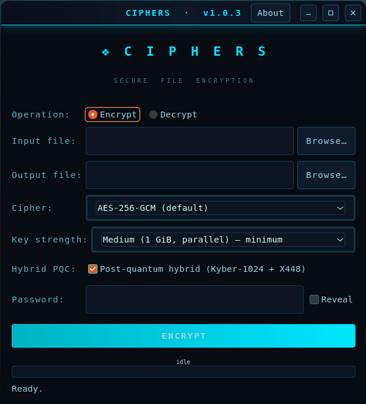

<div align="center">
  
<a href="https://github.com/effjy/ciphers/"></a>

**A simple, secure GTK3 desktop application for encrypting and decrypting files
with modern authenticated encryption — now with post-quantum hybrid key
encapsulation.**

Author: **Jean-Francois Lachance-Caumartin**

[](LICENSE)
[](#)
[](#)
[](#)
[](#)

[](#)
[](#)
[](#)
[](#)
[](#)

</div>

---

## Screenshot

<div align="center">



*The Ciphers main window — pick a cipher, key strength and (optionally) the
post-quantum hybrid layer, then encrypt or decrypt with a single password.*

</div>

---

## Features

- Encrypt and decrypt any file with a password.
- Authenticated encryption with **AES-256-GCM** (default), **XChaCha20-Poly1305**
  or **ChaCha20-Poly1305**.
- Optional **post-quantum hybrid KEM** — **Kyber-1024** (NIST level 5) combined
  with the **X448** elliptic curve. When enabled, the file's AEAD key is the
  shared secret of a hybrid key encapsulation; the matching secret key is
  wrapped with your Argon2id password-derived key, so a single password still
  unlocks the file and the encryption stays secure even against a quantum
  adversary. Hybrid files are auto-detected on decryption.
- **Argon2id** key derivation with a configurable strength setting:
  - **Basic** — 256 MiB
  - **Medium** — 1 GiB, parallel *(minimum recommended)*
  - **Strong** — 4 GiB, parallel
- Chunked streaming encryption with per-chunk authentication, providing
  tamper, reordering and truncation detection.
- **Hardened memory handling** — passwords, derived keys and plaintext are
  held in locked memory that is never written to the swap file and never
  captured in a core dump, and is zeroed after use. The password field itself
  is backed by libsodium guarded memory.
- Optional **password reveal** checkbox for typing long passphrases.
- Background worker thread so the key-derivation step never freezes the UI.

## Prerequisites

You need a C compiler, `make`, and the development packages for GTK3,
libsodium, libargon2 and OpenSSL (libcrypto, used for the X448 curve).

### Ubuntu / Debian

```bash
sudo apt update
sudo apt install build-essential pkg-config \
    libgtk-3-dev libsodium-dev libargon2-dev libssl-dev
```

### Fedora

```bash
sudo dnf install gcc make pkgconf-pkg-config \
    gtk3-devel libsodium-devel libargon2-devel openssl-devel
```

## Building

```bash
make
```

This produces the `ciphers` binary in the project directory. You can run it
directly with `./ciphers`.

## Installing

To install globally so it appears in the Ubuntu applications menu (with its
icon) and shows its icon in the window/taskbar:

```bash
sudo make install
```

This installs:

| File | Destination |
|------|-------------|
| `ciphers` binary    | `/usr/local/bin/ciphers` |
| Application icon    | `/usr/local/share/icons/hicolor/scalable/apps/ciphers.svg` |
| Menu entry          | `/usr/local/share/applications/ciphers.desktop` |

The desktop database and icon cache are refreshed automatically. The app
then appears in your activities/applications menu as **Ciphers**.

To uninstall:

```bash
sudo make uninstall
```

> Installation prefix is configurable, e.g. `sudo make install PREFIX=/usr`.

## Usage

1. Launch **Ciphers** from the applications menu, or run `ciphers`.
2. Choose **Encrypt** or **Decrypt**.
3. Pick the **Input file** and the **Output file** (use the *Browse…* buttons).
4. When encrypting:
   - Select the **Cipher** (AES-256-GCM by default; XChaCha20-Poly1305 or
     ChaCha20-Poly1305 also available).
   - Select the **Key strength** (Medium is the minimum recommended).
   - Optionally tick **Post-quantum hybrid (Kyber-1024 + X448)** for an extra
     post-quantum protection layer.
   - On decryption these are read automatically from the file header.
5. Type your **Password**. Tick **Reveal** to display it while typing.
6. Click **Encrypt** / **Decrypt**. A progress bar shows the operation; key
   derivation can take a moment at higher strengths.

The **About** button shows version, author and the full feature list.

## File format

Encrypted files begin with the magic header `CIPHERS\0` followed by a format
version, the cipher id, the Argon2id parameters (iterations, memory,
parallelism), a random salt and a random base nonce. The payload is split
into 64 KiB chunks, each encrypted as an independent AEAD frame whose
associated data binds the chunk's position and an end-of-stream flag — so
tampering, reordering or truncation is always detected on decryption.

Hybrid (post-quantum) files use format version 2: between the header and the
base nonce they carry a hybrid block — the file's hybrid secret key wrapped
with the password-derived key (XChaCha20-Poly1305) and the KEM ciphertext. On
decryption the password unwraps the secret key, which decapsulates the KEM
ciphertext back to the AEAD key. (The per-file public keys are not stored: they
are not needed to decrypt, and omitting them keeps every header byte
authenticated.) The format version byte lets the app pick the right path
automatically.

If decryption fails, the password is wrong or the file has been corrupted or
tampered with; the partial output file is removed automatically.

## Security notes

- Encryption keys are derived with Argon2id and wiped from memory after use.
- Authenticated encryption (AEAD) guarantees both confidentiality and
  integrity — modified ciphertext will not decrypt.
- Choose **Medium** or **Strong** key strength for sensitive data. Higher
  strengths use more RAM during key derivation (1 GiB / 4 GiB).
- Secrets are kept off disk: core dumps are disabled, and passwords, keys and
  plaintext are stored in locked, non-dumpable memory and zeroed after use.
  Note that GTK itself may still hold short-lived copies of typed text (for
  on-screen rendering, the clipboard or the input method) in ordinary memory,
  so this hardening reduces but cannot fully eliminate exposure.

## Security report

A full security report covers the cryptographic design, file format, the
post-quantum hybrid KEM, the memory-hardening measures, and a detailed threat
model (including what Ciphers explicitly does **not** protect against).

- 📄 **[Read the report (PDF)](security.pdf)**
- 📝 **[LaTeX source (security.tex)](security.tex)**

## Changelog

### v1.0.4

Bug-fix and hardening release — no file-format changes; files written by
earlier versions still decrypt.

- **Hardened** the libsodium-backed secure entry buffer: it now zeroes the
  unused tail of its guarded allocation on every edit, so a typed-then-cleared
  password no longer lingers in locked memory until the widget is freed.
- **Fixed** a potential integer overflow in the secure buffer's capacity
  growth (`ensure_cap`), which could wrap to zero on a pathological paste since
  the password entry has no maximum length.
- **Durability:** encryption and decryption now `fsync` the output file and its
  parent directory before/after the atomic rename, so a crash or power loss can
  no longer publish a truncated or zero-length output file.

### v1.0.3

Bug-fix and hardening release — no file-format changes; files written by
earlier versions still decrypt.

- **Fixed** a use-after-free in the GUI: the key-derivation progress pulse
  timer could outlive the window and fire against freed state if the window
  was closed in the brief gap after a job finished. The timer is now always
  removed when the job completes or the window is destroyed.
- **Fixed** a case where the output's temporary file (`<output>.ciphers-tmp`)
  could resolve to the input file and truncate it before it was read. The
  input/output same-file check now also covers the temporary file.
- **Hardened** decryption against crafted headers: Argon2id parameters from
  the file are now validated against the `m_cost ≥ 8 × parallelism` rule, so
  an out-of-range header is rejected with a clear message instead of failing
  later inside the KDF.
- **Fixed** silent truncation of over-long input/output paths: paths that do
  not fit the internal buffers are now rejected with an error rather than
  quietly truncated (a truncated path could point at a different file).
- Minor comment/documentation corrections.

## License

MIT.
